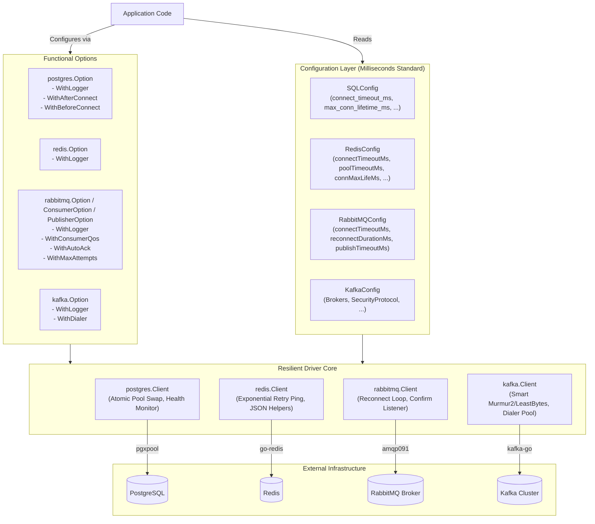
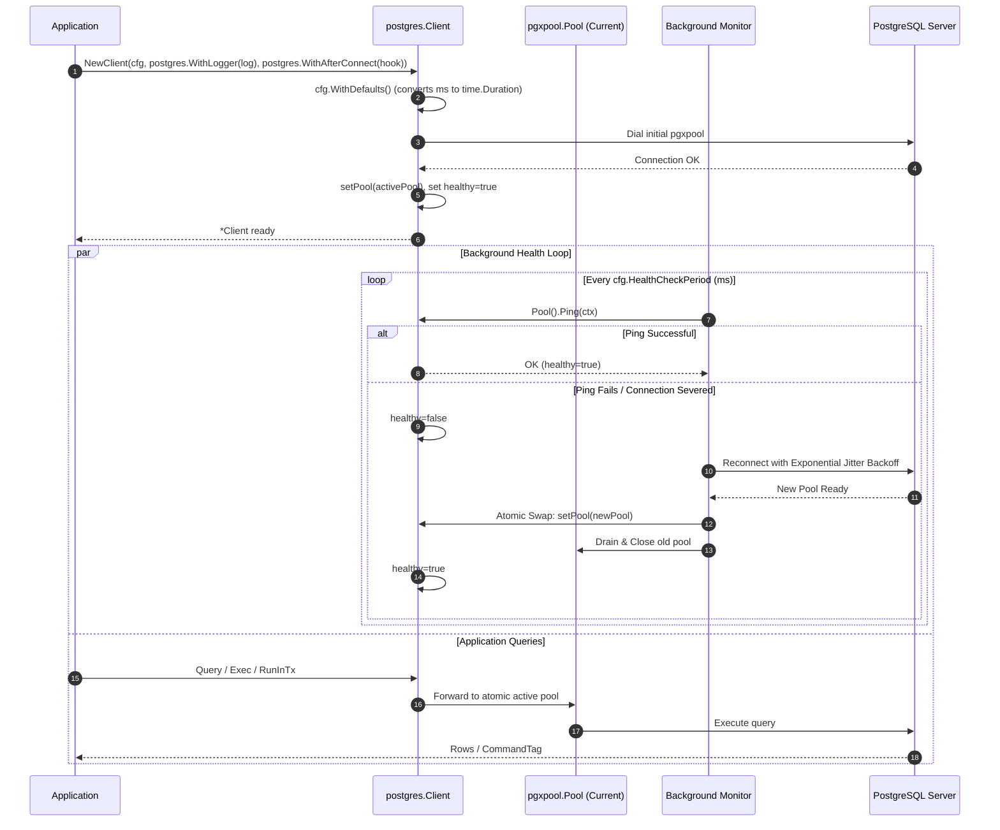
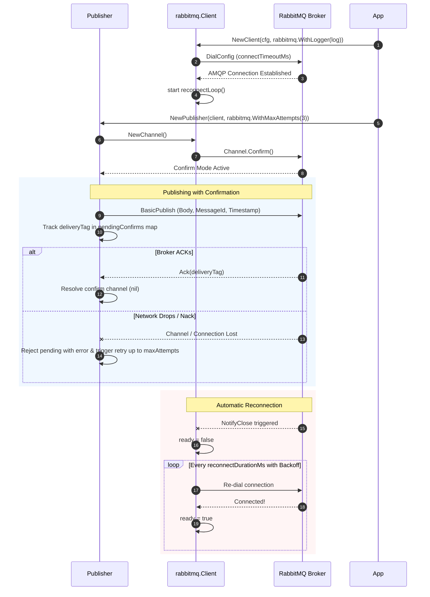

# Technical Documentation & Architecture Reference

## Overview
`nvx-go-driver` is a production-grade infrastructure client library built for Go 1.22+. It unifies connection pooling, reconnection resilience, distributed tracing, metrics, and configuration for PostgreSQL (`pgx/v5`), Redis (`go-redis/v9`), RabbitMQ (`amqp091-go`), and Kafka (`segmentio/kafka-go`).

---

## 1. System Architecture



---

## 2. PostgreSQL Connection Lifecycle & Pool Swapping



---

## 3. RabbitMQ Reconnection & Publisher Confirm Sequence



---

## 4. Configuration Units Migration Reference

All configuration durations have been migrated from raw seconds to explicit milliseconds (`_ms` or `Ms`).

| Struct | Field Name | YAML/JSON Key | Default Value | Equivalent Duration |
| :--- | :--- | :--- | :--- | :--- |
| **`SQLConfig`** | `MaxConnLifetime` | `max_conn_lifetime_ms` | `3600000` | 1 hour |
| | `MaxConnIdleTime` | `max_conn_idle_time_ms` | `600000` | 10 minutes |
| | `HealthCheckPeriod` | `health_check_period_ms` | `15000` | 15 seconds |
| | `ConnectTimeout` | `connect_timeout_ms` | `10000` | 10 seconds |
| **`RedisConfig`** | `StartInterval` | `startIntervalMs` | `2000` | 2 seconds |
| | `PoolTimeout` | `poolTimeoutMs` | `30000` | 30 seconds |
| | `ConnectTimeout` | `connectTimeoutMs` | `5000` | 5 seconds |
| | `ConnMaxLife` | `connMaxLifeMs` | `600000` | 10 minutes |
| **`RabbitMQConfig`**| `ReconnectDuration`| `reconnectDurationMs` | `5000` | 5 seconds |
| | `ConnectTimeout` | `connectTimeoutMs` | `10000` | 10 seconds |
| | `PublishTimeout` | `publishTimeoutMs` | `5000` | 5 seconds |

---

## 5. Functional Options Quick Reference

### PostgreSQL
```go
client, err := postgres.NewClient(&cfg,
    postgres.WithLogger(logger),
    postgres.WithAfterConnect(func(ctx context.Context, conn *pgx.Conn) error {
        _, err := conn.Exec(ctx, "SET timezone = 'UTC'")
        return err
    }),
    postgres.WithBeforeConnect(func(ctx context.Context, connCfg *pgx.ConnConfig) error {
        connCfg.RuntimeParams["application_name"] = "custom-app"
        return nil
    }),
)
```

### Redis
```go
client, err := redis.NewClient(&cfg,
    redis.WithLogger(logger),
)
```

### RabbitMQ
```go
// Client
client, err := rabbitmq.NewClient(&cfg,
    rabbitmq.WithLogger(logger),
)

// Consumer with functional options
consumer := rabbitmq.NewConsumer(client, "orders-queue",
    rabbitmq.WithConsumerQos(20),
    rabbitmq.WithAutoAck(false),
    rabbitmq.WithExclusive(false),
)

// Publisher with functional options
publisher, err := rabbitmq.NewPublisher(client,
    rabbitmq.WithMaxAttempts(5),
)
```

### Kafka
```go
client, err := kafka.NewClient(&cfg,
    kafka.WithLogger(logger),
    kafka.WithDialer(customDialer),
)
```
